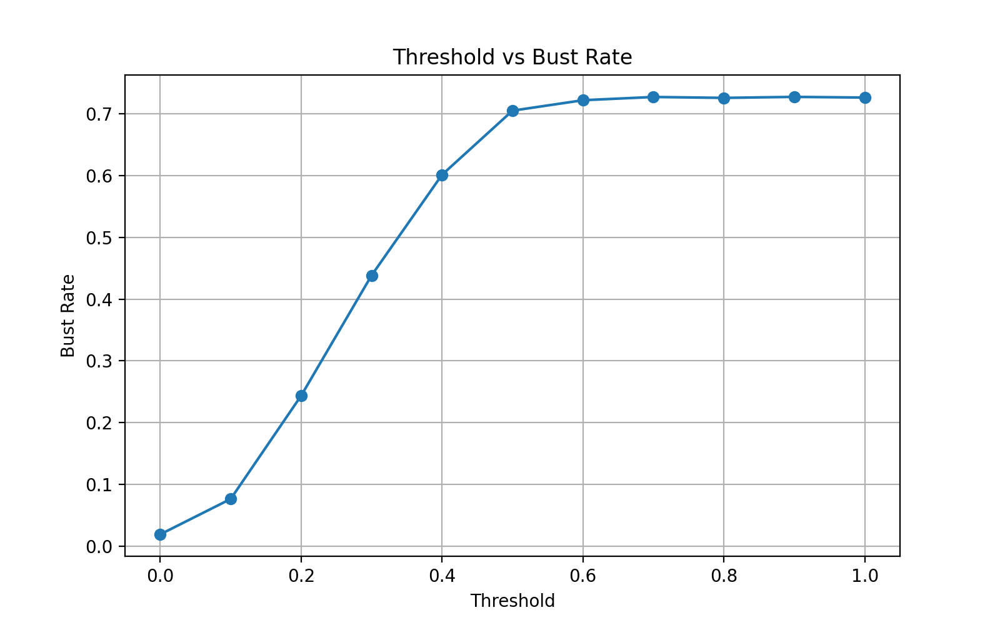
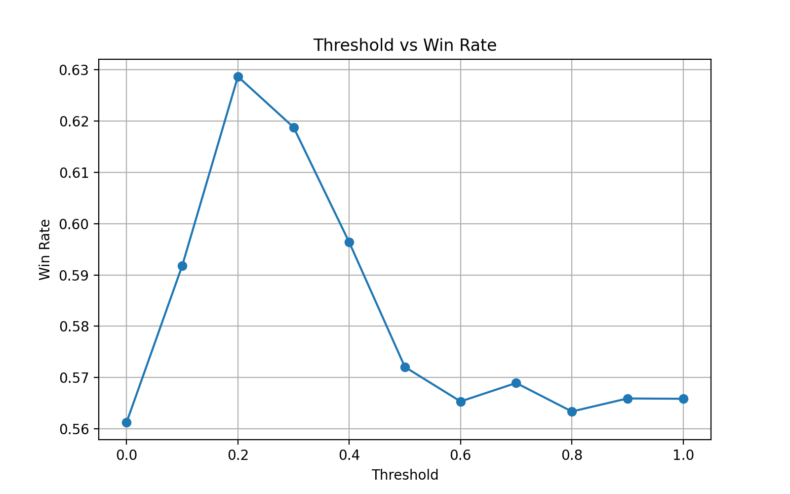
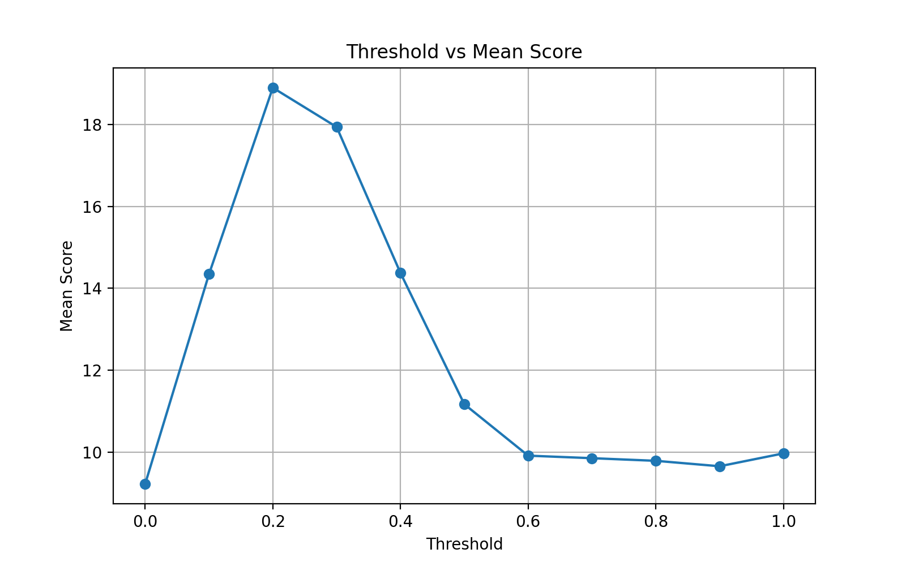
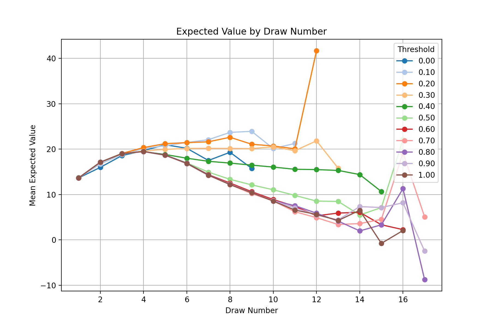

# Flip 7 Analysis

This project used a monte carlo simulation to find the optimal strategy for the card game fliip 7

The program simulated thousands of games to evaluate expected value, winning probability, adn optimal stopping strategies

It answers: "When should you stop flipping cards to maximize your chnace of winning?"

I also made a tool for new players to actually see their bust rates as they go on.

## Features
Calcuates the expected value of continung to flip versus stopping

Runs hundreds of thousands of games against bots modeled by human greed

Bust rate calculator shows you your chance of busting based on all the cards drawn

## Photos

